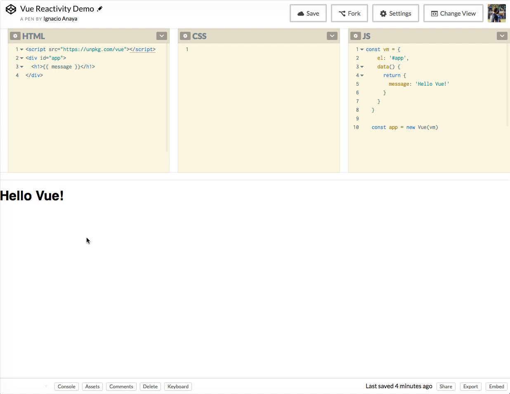

# 📚 Introducción a Vue

Vue (se pronuncia como la palabra en ingles *view*), es un [framework progresivo](#aclaraciones) para construir interfaces de usuario. A diferencia de alternativas monolíticas (como por ejemplo Angular :agite:) Vue esta diseñado para ser adoptado (y aprendido) fácilmente.
El core de Vue esta pensado para enfocarse en la capa de la vista del patron MV* lo cual permite integrarlo en cualquier proyecto existente de forma muy simple.
Mas allá de su sencillez Vue es capaz de construir todo tipo de aplicaciónes cuando se lo combina con las herramientas y librerías adecuadas.

# 👋 Hello Vue!

La manera mas fácil de empezar a usar Vue es usando algún editor de código online ([JSFiddle](https://jsfiddle.net) o [Codepen](https://codepen.io)).

1. Lo primero que necesitamos es cargar la librería de Vue.
  ```html
  <script src="https://unpkg.com/vue"></script>
  ```

2. Ahora necesitamos crear un poco de HTML donde luego vamos a *montar* nuestra aplicación.
  ```html
  <div id="app">
    {{ message }} <!-- Esto es una expresion -->
  </div>
  ```

3. Por ultimo vamos a crear la instancia de Vue la cual nos va a permitir enlazar (*bind*) nuestro código con nuestra vista.

  ```javascript
  const vm = {
    el: '#app',
    data() {
      return {
        message: 'Hello Vue!'
      }
    }
  }

  const app = new Vue(vm)
  ```

Acabamos de hacer nuestra primera aplicación con Vue. Como mencionamos antes, el framework se enfoca en la parte de la vista y lo que acabamos de hacer implica crear una interacción entre código JS y vista HTML. Vamos a repasar lo que esta ocurriendo acá:

1. En la parte HTML hay 2 cosas importantes a tener en cuenta:
    1. Agregamos un elemento `<div id="app">`. Esto es de suma importancia ya que nos va a servir para indicarle a Vue cual es el alcance (*scope*) de nuestra aplicación.
    2. Agregamos una expresión `{{ message }}`. Las expresiones nos permiten definir valores dinámicos en nuestro HTML. Esto quiere decir que nuestra aplicación en lugar de mostrar la palabra `"message"` va a mostrar el valor de una variable/propiedad llamada `message`. Luego a través de código nos encargamos de definir el valor de `message` y Vue es quien se ocupa de enlazar ese valor en la vista.

2. En la parte JS creamos un objeto `vm` (*View Model*). Podemos apreciar que es simplemente un objeto JS plano. Este objeto tiene toda la configuración necesaria que Vue necesita para crear nuestra app.
    1. Dentro de esto objeto tenemos una propiedad `el` que, a través de un selector de CSS, define el elemento HTML donde se va a montar la aplicación. En este caso `<div id="app">`.
    2. Por otro lado tenemos una función que se llama `data` la cual **devuelve un objeto**. Dentro de este objeto establecemos todas las propiedades que Vue puede utilizar para mostrar en la vista. En resumen, al crear la propiedad `message` dentro de `data` estamos permitiendo que luego, en nuestro HTML, podamos mostrar el contenido de dicha propiedad usando la expresión `{{ message }}`.
    3. El último paso es crear una instancia de Vue pasando como configuración nuestro objeto `vm`.


# 🏃‍ Reactividad

Vue trabaja con el concepto de reactividad, lo cual quiere decir que todos los cambios que hagamos en nuestro `vm` (JS) se van a reflejar de manera automática en la vista (HTML). Podemos ver como funcióna esto de la siguiente manera:

1. Abrimos el siguiente [link](https://codepen.io/ianaya89/pen/aWRMQV). Contiene la app básica que creamos antes.
2. Una vez en Codepen hacemos click en la tab que dice *Console*.
3. Dentro de la consola podemos acceder a la variable `app` que creamos y modificar el valor de la propiedad `message` escribiendo: `app.message = 'Bye Vue!'`. Apretamos *enter* y vamos a notar que el nuevo valor es renderizado automáticamente en el HTML.



___
### 👉 Aclaraciones
> Cuando decimos que Vue es un framework progresivo esta relacionado con que nos permite que nuestra aplicación evolucione (o escale) paso a paso. Esto quiere decir que podemos arrancar con un proyecto muy sencillo (como una landing page) sin necesidad de tener que cargar módulos o funcionalidad que no necesitamos. Luego, a medida que nuestros requerimientos se tornen mas complejos podemos incorporar esta funciónalidad (y otras herramientas) que nos permitan manejar estos nuevos requerimientos.

> Vue (al igual que el DOM) trabaja con una estructura de en árbol en cuanto a HTML. Partimos de un componente `root` que representa nuestra aplicación y todos los demás componentes hijos de `root`. En nuestro caso el componente principal es `<div id="app">`. Esto implica que todo lo que esté por fuera de ese `<div>` esta fuera del alcance de Vue. Podemos probar agregando la expresión {{ message }} fuera del `<div>` principal y veremos que deja de funcionar como esperamos.

> El nombre `vm` es simplemente para darle un significado semántico a nuestros ejemplos ya que se supone que cada componente de Vue recibe un objeto con configuración que representa al *View Model*. Esta variable podría tener cualquier nombre, incluso podríamos no crearla y definir el objeto dentro de la instancia de Vue: `const app = new Vue({})`.


### 📝 [Solución](https://jsfiddle.net/ianaya89/f8s8nh58)
<p text-align="left">
  [⏩](https://github.com/ianaya89/workshop-vuejs/blob/master/ex/02.md)
</p
