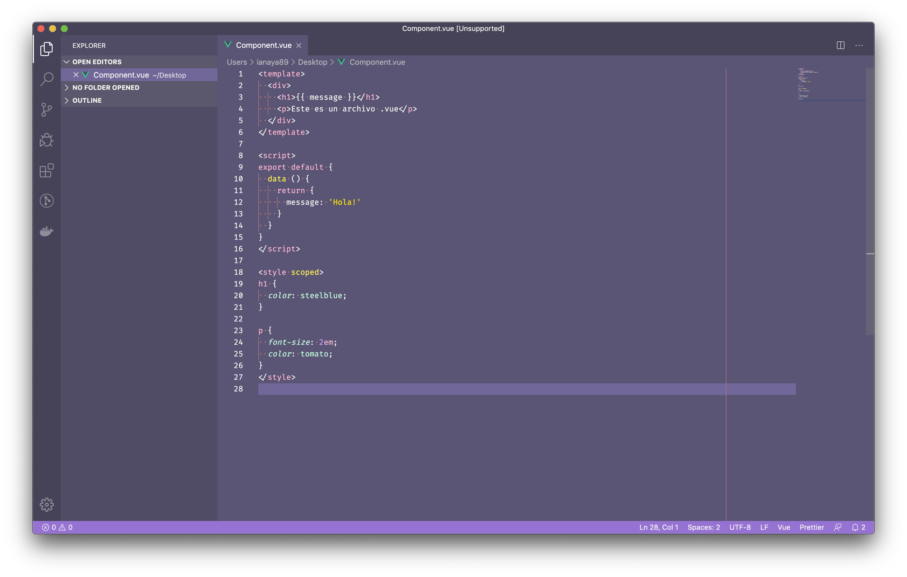

# 👨‍🎓 Vue Avanzado (SFC)

Ahora que ya sabemos los conceptos básicos de Vue, vamos a aprender a crear aplicaciones web más profesionales.

Hasta ahora vimos que implementar el framework es muy fácil, simplemente tenemos que agregar la referencia y crear la instancia escribiendo `new Vue({})`. El asunto es que en la mayoría de los casos vamos a querer hacer aplicaciones mas complejas en lugar de prototipos o *landing pages*.

Recordemos que Vue esta basado en un concepto progresivo y que a medida que nuestra aplicación incremente la complejidad podemos acompañar ese proceso con herramientas o librerías que nos permitan trabajar de manera más óptima.

## *Single File Components* (`.vue`)

Lo primero que vamos aprender ahora es la *magia* de los archivos `.vue` (SFC: *Single File Components*). Esto nos permite crear componentes en archivos (1 componente = 1 archivo) y escribir todo el código, vista y estilos que pertenece a ese componente.

La estructura de un archivo `.vue` es la siguente:

Como ven es muy intuitivo, usamos el tag `template` para HTML, `script` para JS y `style` para CSS.
Las ventajas de los archivos `.vue` son las siguientes:

1. Facilitamos el manejo de código HTML en cada componente ya que no usamos mas una variable `string`.
2. Podemos agregar estilos (CSS) específicos para nuestros componentes. Incluso, usando el atributo `scoped` podemos hacer que sos estilos apliquen unicamente al componente en cuestion.
3. Nos permiten integrar *pre procesadores* como [Bebel](http://babeljs.io/), [Sass](http://sass-lang.com/) y [Pug](https://pugjs.org/api/getting-started.html).

Si bien los archivos `.vue` son geniales para los desarrolladores, tenemos un pequeño problema. El browser no soporta este tipo de archivos 😅

Para poder utilizarlos vamos a tener que incorporar algún sistema de *build*. Esto quiere decir que nosotros como programadores vamos a codear nuestra aplicación en componentes dentro de archivos `.vue` pero con la ayuda de herramientas como [Webpack](https://webpack.github.io/) o [Rollup](https://rollupjs.org/), nuestro código se va a compilar a archivos `.js` que el browser puede interpretar.

En general este proceso de compilación tiende a ser un poco mas complejo y esta fuera del alcance de este Workshop.

Por suerte para nosotros, vamos a hacer de este proceso una **caja negra**, ya que vamos confiar en el ecosistema de Vue para configurar e iniciar nuestro proyectos. 💪🏼😎.

[⏪](https://github.com/ianaya89/workshop-vuejs/blob/master/ex/04.md)  [⏩](https://github.com/ianaya89/workshop-vuejs/blob/master/ex/06.md)
