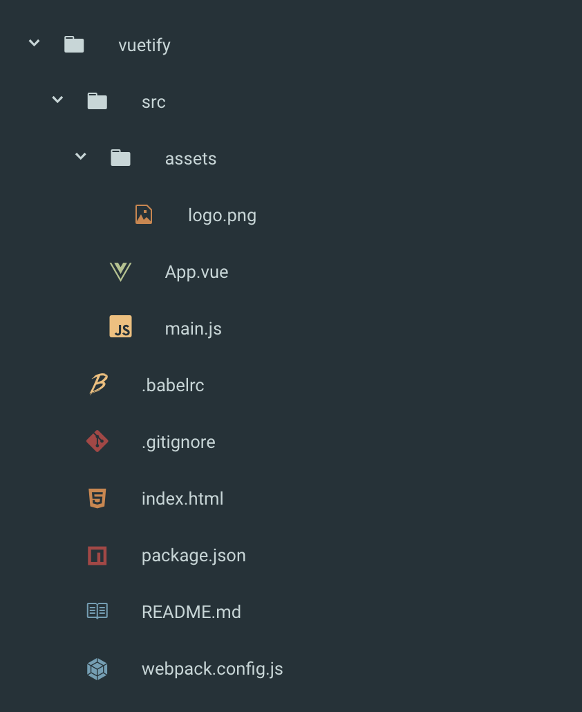
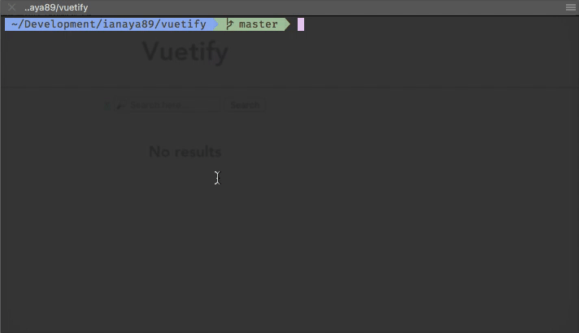

# 🖥 CLI

Un CLI (*Command Line Interface*) es una pequeña utilidad o aplicación que nos permite interactuar con un programa a través de comandos o instrucciones. Cuando usamos [npm]() para instalar una librería, estamos usando un CLI.

Vue tiene su propio CLI ([vue-cli](https://github.com/vuejs/vue-cli)), el cual tiene un propósito muy simple: servir como generador de aplicaciones. Nos permite crear todo el *set up* inicial de nuestros proyectos basándose en diferentes tipos de templates. Lo bueno de esta utilidad es que no solo crea todos los archivos necesarios sino que también se encarga de configurar todas las herramientas y librerías que el template establece.

En nuestro caso vamos a usar Webpack y como les prometí antes vamos a dejar que Vue se encargue de hacerlo funcionar por nosotros.

## vue-cli
El CLI de Vue esta desarrollado en node y es parte del repositorio público de npm por lo cual podemos instalarlo simple y de manera global para usarlo en nuestra terminal de comandos.

1. Abrimos una terminal
2. Instalamos `vue-cli` usando npm (recuerden que el *flag* `-g` indica instalación global)
```bash
$ npm install -g vue-cli
```
3. Usando la terminal navegamos hasta el directorio donde queramos crear nuestra aplicación usando el comando `cd`.
4. Creamos nuestro proyecto usando el comando `vue init [template] [nombre de proyecto]`:
```bash
$ vue init webpack-simple vuetify
```


> `webpack-simple` es el nombre del template que vamos a utilizar y `vuetify` es el nombre de nuestro proyecto.

Una vez finalizado esto y si no tuvimos ningún tipo de error podemos ver que el CLI nos generó un proyecto con la siguiente estructura:



## npm run dev

Si nunca usaron npm scripts pueden chequear como se comportan en la [documentación](https://docs.npmjs.com/misc/scripts). Mientras tanto podemos describirlos como comandos personalizados que nos permiten (entre otras cosas) disponer de las herramientas o librerías de npm (locales) en nuestra terminal.

Si directamente nunca usaron npm, pueden empezar por [acá](https://docs.npmjs.com/getting-started/what-is-npm). Entendamos que npm es un manejador de dependencias, nos permite compartir y utilizar código a través de un registro online. Lo utilizamos principalmente para instalar Vue, Webpack, Babel, etc.

Volviendo al tema de los scripts, estos se describen en el archivo `package.json`. Este archivo contiene toda la metadata de nuestro proyecto, los scripts y todas las dependencias que utilizamos. Al contar con toda esta información, este archivo me permite tener un ambiente de desarrollo reproducible en cualquier otra computadora.

Si inspeccionamos el `package.json` creado por el CLI nos encontramos con dos scripts:

```json
"scripts": {
  "dev": "cross-env NODE_ENV=development webpack-dev-server --open --hot",
  "build": "cross-env NODE_ENV=production webpack --progress --hide-modules"
},
```

1. `dev` ➡️ Incia la aplicación en modo de desarrollo utilizando webpack
2. `build` ➡️ Compila nuestra aplicación lista para llevar a produccion.

> Todos los scripts de npm los ejecutamos con el comando `npm run [nombre de script]`. A excepción de los comandos `test` y `start` donde podemos omitir el uso de `run`.

Es momento de iniciar nuestra aplicación y para eso nos quedan 2 cosas por hacer:

1. Volvemos a la terminal (siempre posicionados en el path del proyecto) y ejecutamos `$ npm install`. Este comando instala todas las dependencias del `package.json` en nuestra computadora.

2. Una vez que la instalación finalizo vamos a usar `$ npm run dev` para iniciar nuestra aplicación.



Listo, nuestra aplicacion ya se esta ejecutando en http://localhost:8080 y ya tenemos todo lo que necesitamos para empezar a trabajar con Vue de forma profesional :agite:.
