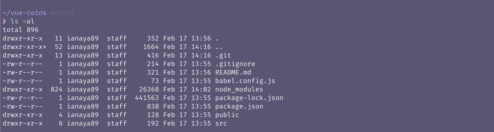

# 🖥 CLI

Un CLI (*Command Line Interface*) es una pequeña utilidad de consola que nos permite interactuar con un programa a través de comandos o instrucciones. Cuando usamos [npm](https://www.npmjs.com/) para instalar una librería, estamos usando un CLI.

Vue tiene su propio CLI ([@vue/cli](https://cli.vuejs.org/)), el cual tiene un propósito muy simple: facilitar y acelerar el desarrollo aplicaciones con Vue. Nos permite crear todo el *set up* inicial de nuestros proyectos utlizando diferentes tipos de plugins, segun las necesidades que tengamos. Lo bueno de esta utilidad es que no solo crea todos los archivos necesarios, sino que también nos abstrae de la configuración inicial que requerie el proyect. De esta forma podemos empezar a programar desde el momento cero, sin necesidad de ocuparnos del *setup* inicial.

En nuestro proyecto vamos a usar los plugins default:
- [Babel](https://cli.vuejs.org/core-plugins/babel.html)
- [Eslint](https://cli.vuejs.org/core-plugins/eslint.html)

Es importante aclarar, que el CLI cuenta con otros plugins como **PWA** o **TypeScript** y ademas nos da la facultad de crear plugins propios. [Aca](https://awesomejs.dev/for/vue-cli/) podes encontrar un listado de plugins realizados por otros desarrolladores.

## @vue/cli
El CLI de Vue esta desarrollado en node y es parte del repositorio público de npm, por lo cual podemos instalarlo de manera global para usarlo en nuestra terminal de comandos.

1. Abrimos una terminal
2. Instalamos `@vue/cli` usando npm (recuerden que el *flag* `-g` indica instalación global)
```bash
$ npm i -g @vue/cli
```
3. Usando la terminal navegamos hasta el directorio donde queramos crear nuestra aplicación usando el comando `cd`.
4. Creamos nuestro proyecto usando el comando `vue create [nombre de proyecto]`:
```bash
$ vue create vue-coins
```
5. Seleccionamos el preset *default* (babel, eslint) y presionamos *enter*.


> 👌 Para el cli, un *preset* es un conjunto de plugins. Cuando creamos un proyecto y seleccionamos los plugins que queremos, el cli nos ofrecer guardar esa selección como un *preset*. Asi es como la próxima vez que creemos un proyecto podemos reutilizar facilmente esa configuración.


> 💸 `vue-coins` es el nombre que vamos a usar para nuestro nuestro proyecto.

Una vez finalizado esto y si no tuvimos ningún tipo de error, vas a navegar al directorio de la aplicacion usando el comando `cd` y luego correr el proyecto con el comando `npm run serve`.

1. `$ cd vue-coins`
2. `$ npm run serve`


Luego de correr estos comandos vas a ver en la terminal una URL apuntando a *localhost* y el puerto 8080 (el puerto puede variar si lo tenes utilizado por otro proceso). Podes abrir la URL [http://localhost:8080](http://localhost:8080) en tu navegador y vas poder tu primera App de Vue funcionando 🙌.


## `npm run serve`

Si nunca usaron npm scripts pueden chequear como se comportan en la [documentación](https://docs.npmjs.com/misc/scripts). Mientras tanto podemos describirlos como comandos personalizados que nos permiten, entre otras cosas, disponer de las módulos o librerías de npm (locales) en nuestra terminal.

Si directamente nunca usaron npm, pueden empezar por [acá](https://docs.npmjs.com/getting-started/what-is-npm). Entendamos que npm es un manejador de dependencias, nos permite compartir y utilizar código a través de un registro online. Lo utilizamos principalmente para instalar Vue, el cli, Babel, etc.

Volviendo al tema de los scripts, estos se configuran en el archivo `package.json`. Este archivo contiene toda la metadata de nuestro proyecto, los scripts y todas las dependencias que utilizamos. Al contar con toda esta información, este archivo me permite tener un ambiente de desarrollo reproducible en cualquier otra computadora.

Si inspeccionamos el `package.json` creado por el CLI nos encontramos con dos scripts:

```json
// package.json
"scripts": {
  "serve": "vue-cli-service serve",
  "build": "vue-cli-service build",
  "lint": "vue-cli-service lint"
},
```

1. `serve` ➡️ Incia la aplicación en modo de desarrollo.
2. `build` ➡️ Compila nuestra aplicación para llevar a produccion.
3. `lint`  ➡️ Corre el proceso de *linting* en nuestros archivos.

> 👌 Todos los scripts de npm los ejecutamos con el comando `npm run [nombre de script]`. A excepción de los comandos `test` y `start` donde podemos omitir el uso de `run`.


## Proyecto

Si abrimos el proyecto con el editor de texto, vamos a poder ver como es la estructura de archivos de la applicación, que mas adelante vamos a analizar detalladamente.


> 👌 Si estas dentro del directorio `vue-coins` y estas usando VS Code, podes abrir todo el proyecto con el comando: `$ code .`.

> 👌 Tambien podes usar el comando: `$ ls -al` para listar los archivos/directorios que fueron creados por el CLI.




Listo, nuestra aplicacion ya se esta ejecutando en http://localhost:8080 y ya tenemos todo lo que necesitamos para empezar a trabajar con Vue de forma profesional.

[⏪](https://github.com/ianaya89/workshop-vuejs/blob/master/ex/05.md)  [⏩](https://github.com/ianaya89/workshop-vuejs/blob/master/ex/07.md)
