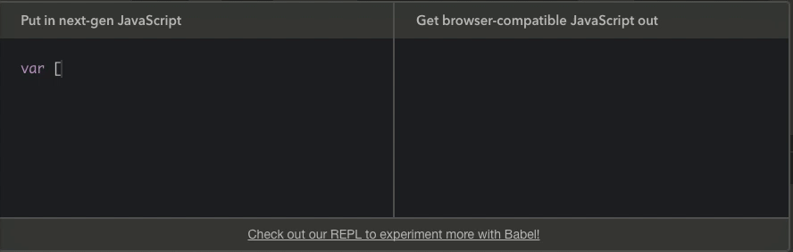

# 👷 Arquitectura

Antes de comenzar a escribir el código de nuestra aplicación vamos a repasar la estructura y librerías instaladas por el CLI.

## Babel

[Babel](http://babeljs.io/) es un transpilador de codigo. Nos permite transformar y compilar código ES2015 (y mas) a código equivalente ES5. La ventaja de esta herramienta es que podemos usar las últimas funcionalidades de JS disponibles sin tener que preocuparnos porque estas vayan a ser soportadas o no por los navegadores.

> Cuando decimos ES2015 nos referimos desde esa versión en adelante. Recuerden que desde el 2015 las versiones de JS son anuales por lo cual cada año tenemos una versión con nueva funcionalidad disponible.



Para saber mas sobre esta herramienta pueden chequear lo [documentacion](http://babeljs.io/docs/setup/). En nuestro caso nos alcanza simplemente con entender para que sirve y como se configura.

La configuración es sencilla, pero no necesitamos hacerla ya que el CLI lo hizo por nosotros. Si chequean en el proyecto generado van a encontrar un archivo llamado `.babelrc`. Este es un archivo con formato `json` donde indicamos que *[presets](http://babeljs.io/docs/plugins/)* queremos utilizar. Los *presets* son plugins donde se define que tipo de funcionalidades ES2015 vamos a querer utilizar o soportar.

```json
{
  "presets": [
    ["latest", {
      "es2015": { "modules": false }
    }]
  ]
}
```

## Webpack

La segunda herramienta importante a utilizar es [Webpack](https://webpack.js.org/), el *module bundler*. Webpack nos va a permitir procesar todo nuestro código y generar un único archivo de salida (aunque podrían ser mas). La ventaja de Webpack es que no solo permite compilar código JS sino también contenido estático como archivos `.svg`, `.png` o `.css`

Si bien hay muchas cosas configurables en Webpack, el CLI también se encarga de generar todo el *set up* por nosotros. Si miramos el archivo `webpack.config.js` vamos a encontrar varias propiedades que definen como vamos a utilizar la herramienta.

1. **Entry** ➡️ esto se refiere al archivo de entrada. En base a este archivo principal de nuestra aplicación, Webpack va a construir el *bundle* final.

```javascript
entry: './src/main.js',
```
2. **Output** ➡️ contiene la información del archivo de salida que Webpack va a generar (el *bundle* final).

```javascript
output: {
  path: path.resolve(__dirname, './dist'),
  publicPath: '/dist/',
  filename: 'build.js'
},
```

3. **Rules** ➡️ las reglas son procesos intermedios que se van a aplicar durante la generación del *bundle* y nos permiten transformar o modificar código. Para estos procesos puedan funcionar correctamente se utilizan plugins denominados `loaders`.

> Por ejemplo en nuestro caso hay 2 procesos importantes: el primero es la integración con Babel. Webpack a través de Babel va a compilar nuestro código de ES2015 a ES5 antes de generar el *bundle* final.

> El segundo es la compilación de los archivos `.vue`. Sabemos que estos archivos no son soportados por el browser por lo tanto Webpack se va encargar de compilar los archivos en algo que el navegador pueda interpretar.

> En resumen, nuestra aplicación cuenta con el `vue-loader` y el `babel-loader`. También tenemos otros procesos menos importantes que nos permiten procesar archivos CSS, imágenes e incluso URL's.

```javascript
module: {
  rules: [
    {
      test: /\.vue$/,
      loader: 'vue-loader',
    },
    {
      test: /\.js$/,
      loader: 'babel-loader',
      exclude: /node_modules/
    },
}
```

Dentro del archivo `webpack.config.js` hay muchas otras cosas que se pueden customizar pero por el momento no son relevantes para nosotros.

Lo último que debemos saber es que Webpack también nos permite trabajar con una version de desarrollo pero también es capaz de generar una version productiva de nuestra aplicación lista para ser *hosteada*.

Para la version de desarrollo se utiliza un plugin llamado `webpack-dev-server` que también viene todo listo para usar. Esta herramienta nos va a permitir integrar un servidor web a nuestra aplicación mientras desarrollamos.


## `main.js`

Este es el archivo principal de nuestra aplicación. Es aca donde vamos importar la librería `Vue` e inicializar nuestro componente principal `App.vue`

```javascript
import Vue from 'vue'
import App from './App.vue'

new Vue({
  el: '#app',
  render: h => h(App)
})
```

Como pueden ver estamos usando [ES Modules](https://developer.mozilla.org/es/docs/Web/JavaScript/Referencia/Sentencias/import) para importar (y exportar) archivos `.js`. Esto es posible gracias a Babel y Webpack ya que no es algo que soporten los navegadores de forma nativa.

Lo primero que vemos es la propiedad `el` que establece que nuestra app se renderizará sobre el elemento con `id === 'app'`.

Por otro lado vemos una nueva función en nuestro componente principal: `render`. Esta propiedad reemplaza `template` y si bien en nuestro caso no presenta ninguna ventaja, esta función nos sirve crear HTML *programaticamente* e incluso compilar JSX o TypeScript.

> Para los que no esta familiarizados con [*Arrow Function*](https://developer.mozilla.org/en/docs/Web/JavaScript/Reference/Functions/Arrow_functions), el código que vemos en `render` equivale a `render: function(h) { return h(App) }`


## `App.vue`

Este archivo representa a nuestro componente principal. Si bien es una buena práctica llamarlo `App`, podría tener el nombre que nosotros queramos. Como mencionamos antes, este archivo concentra toda la lógica (JS), estructura (HTML) y estilos (CSS) del componente.
Lo importante a tener en cuenta es que los tags `script` y `style` son opcionales pero no así el tag `template`.

Por otro lado siempre que tengamos un tag `script` tenemos que usar la sintaxis *default* de *ESModules* para exportar un objeto.


```html
<script>
export default {
  name: 'app',
  data () {
    return {
      msg: 'Welcome to Your Vue.js App'
    }
  }
}
</script>
```

Si prestan atención, el objeto que exportamos no es mas que un `vm` (*ViewModel*) que respeta la estructura y propiedades que aprendimos anteriormente.

## `index.html`

Por ultimo vamos a destacar el archivo `index.html`, es el único `.html` que tenemos (y que necesitamos), sobre este archivo se va a montar nuestra aplicación y también va a servir mas adelante para generar la version productiva de la misma.

En este archivo encontramos solamente dos cosas. Una referencia a un archivo `.js` que es nada menos que el *bundle* de Webpack (definido en `webpack.config.js`). Y un `<div id="app">`.

```html
<!DOCTYPE html>
<html lang="en">
  <head>
    <meta charset="utf-8">
    <title>Vuetify</title>
  </head>
  <body>
    <div id="app"></div>
    <script src="/dist/build.js"></script>
  </body>
</html>
```
