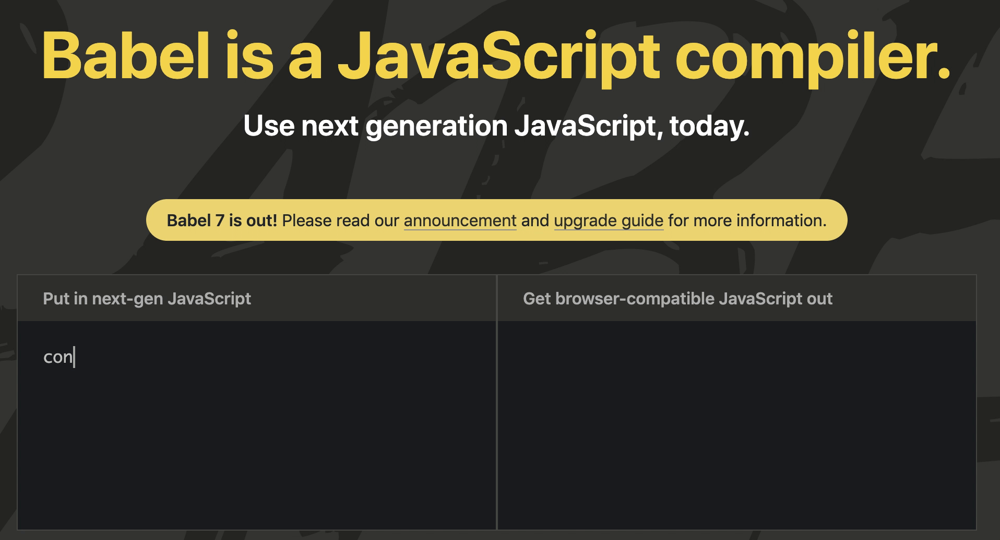
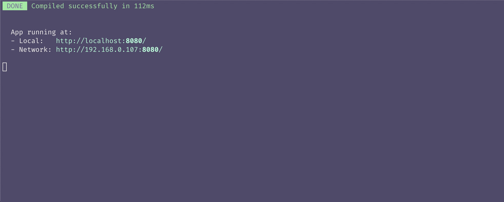
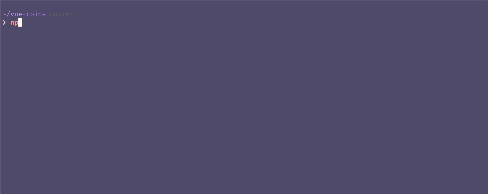
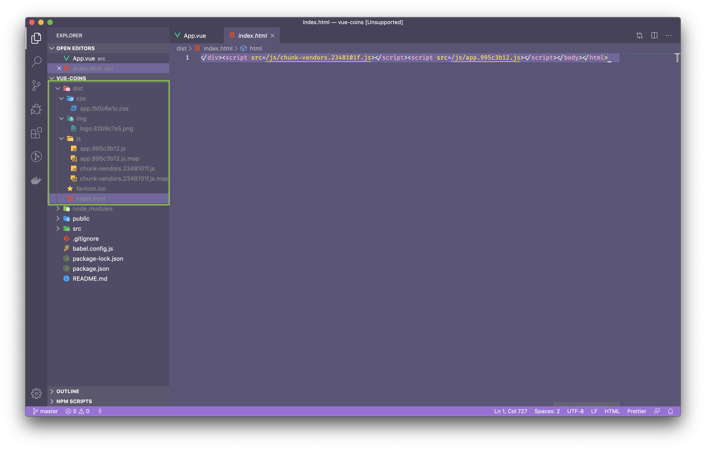

# 👷 Arquitectura

Antes de comenzar a escribir el código de nuestra aplicación vamos a repasar la estructura del proyecto y librerías instaladas por el CLI.

## Babel

[Babel](http://babeljs.io/) es un transpilador de código. Nos permite transformar y compilar código ES2015 (en adelante) a código equivalente ES5 (o código para browsers *legacy*). La ventaja de esta herramienta es que podemos usar las últimas funcionalidades de JS disponibles sin tener que preocuparnos porque estas vayan a ser soportadas o no por los navegadores.

> 👀 Cuando decimos ES2015 nos referimos desde esa versión en adelante. Recuerden que desde el 2015 las versiones de JS son anuales, por lo cual cada año tenemos una versión con nueva funcionalidad disponible.



Para saber más sobre esta herramienta pueden chequear lo [documentación](http://babeljs.io/docs/setup/). En nuestro caso nos alcanza simplemente con entender para que sirve y como se configura.

La configuración es sencilla, pero no necesitamos hacerla ya que el CLI lo hizo por nosotros. Si chequean en el proyecto generado van a encontrar un archivo llamado `babel.config.js`. Este es un archivo con formato `js` donde indicamos que *[presets](http://babeljs.io/docs/plugins/)* queremos utilizar y donde podemos modificar otros aspectos de la configuración de Babel. Los *presets* son utilidades donde se define que tipo de funcionalidades ES2015 vamos a querer utilizar o soportar.

> 👀 Tanto en Babel como en @vue/cli utilizamos el concepto de presets, pero a no confundirse ya que son cosas diferentes.

```js
// Archivo babel.config.js
module.exports = {
  presets: [
    '@vue/cli-plugin-babel/preset'
  ]
}
```

> El [@vue/cli-plugin-babel/preset](https://github.com/vuejs/vue-cli/tree/dev/packages/@vue/cli-plugin-babel#readme), es el preset para Babel oficial (y recomendado) de Vue, podemos combinarlo con otros presets o incluso optar por usar uno diferente.


## ESLint

[ESlint](https://eslint.org) es una herramienta de *linting*. Este tipo de herramientas nos permiten detectar errores, malas prácticas y establecer un formato uniforme en nuestro código. Puede utilizarse y configurarse con diferentes tipos de reglas. En nuestro caso estamos usando la configuración defualt que nos genera el CLI. En caso de querer customizar el uso de eslint, podemos hacerlo modificando el objeto `eslintConfig` que se encuentra en el archivo `package.json`:

```json
  // archivo package.json
  "eslintConfig": {
    "root": true,
    "env": {
      "node": true
    },
    "extends": [
      "plugin:vue/essential",
      "eslint:recommended"
    ],
    "parserOptions": {
      "parser": "babel-eslint"
    },
    "rules": {}
  },
```

> 👌 A veces es un poco molesto, tener la configuración en el package.json. De ser asi, podes crear un archivo llamado `eslint.json` y mover todo el contenido de `eslintConfig` a ese archivo.

Al igual que con Babel, ya tenemos todo listo y configurado para usar eslint en nuestro proyecto. A menos que querramos tener reglas especificas o modicar algo, no necesitamos cambiar nada. Cuando tengamos determinado código que no cumpla las reglas establecedidas, vamos a poder ver en la terminal un mensaje indicando que es lo que esta sucediendo.



> 👌 Existe un [plugin para VS Code](https://marketplace.visualstudio.com/items?itemName=dbaeumer.vscode-eslint) que nos permite detectar estos errores de manera mas amigable dentro del editor de texto. Tambien hay plugins para la mayoria de los editores como Sublime o Atom.

> 📏 Lo mas importante de ESLint no son las reglas en si, sino que TODOS vamos a usar las mismas. Podemos consensuar con el equipo nuestro estilo y formato de código. Al final del día vamos a obtener un código más ordenado, uniforme y mas fácil de mantener. 😉

## Webpack & Build

[Webpack](https://webpack.js.org/) es el *module bundler* utilizado internamente por el proceso de `serve` y `build` de `@vue/cli`. Es quien se va a encargar de procesar nuestros archivos y transformar el código de desarrollo en código productivo (optimizado para los browsers).

Nosotros como desarrolladores, necesitamos un código legible, modularizado y semántico. En cambio los browsers necesitan todo lo contrario para que nuestra aplicacion funcione de la forma mas óptima y rápida posible. Este tipo de herramientas permiten que tanto los browsers como los desarrolladores esten contentos y mantener las dos versiones en nuestro codigo 😃

Ademas, es en este proceso de compilación donde nuestro código es transpilado por Babel. Escribimos el código usando las últimas y mejores funcionalidades de JavaScript posibles, y el CLI con webpack y babel detras, se encargaran de generar el código compatible necesario.

No solo compilamos archvios `.js`, Webpack tambien puede compilar recursos estáticos como `.css`, `.png` o `.svg`.

Lo bueno es que el CLI hizo todo por nosotros nuevamente y no tenemos nada que configurar acá.
Y si bien no es nuestro caso, tambien tenemos la facilidad de poder modificar esta configuración y agregar todo lo que necesitemos creando un archivo llamado `vue.config.js` en el directorio principal del proyecto.

Para entender un poco mas en detalle como funciona, podemos probar corriendo el comando `$ npm run build` en la terminal. Recorda estar posicionado en el directorio principal del proyecto.



Una vez que hayas corrido el comando, vas a ver que se creo un directorio llamado `dist`, el cual contiene todos nuestros archivos procesados para ser llevados a producción. En el caso de querer hacer un deploy, simplemente tenes que trasaladar esta carpeta a tu servidor web o plataforma de deploy favorita.




## `main.js`

Este es el archivo principal de nuestra aplicación. Es aca donde vamos importar la librería `Vue` e inicializar nuestro componente principal `App.vue`

```javascript
import Vue from 'vue'
import App from './App.vue'

Vue.config.productionTip = false

new Vue({
  render: h => h(App),
}).$mount('#app')

```

Como pueden ver estamos usando [ES Modules](https://developer.mozilla.org/es/docs/Web/JavaScript/Referencia/Sentencias/import) para importar (y exportar) archivos `.js`. Si bien es una funcionalidad soportada en navegadores modernos, Babel y Webpack nos aseguran que nuestro código, con esta implementacion, va a funcionar tambien en navegadores mas obsoletos.

Seguramente lo primero que notas, es que en lugar de el atributo `el`, se esta usando la función `$mount('#app')`. Si bien tienen una sútil diferencia, cumple con el mismo propósito: establecer sobre que elemento del DOM vamos a montar la instancia principal de Vue usando un selector de CSS.

Por otro lado vemos una nueva función en el componente principal: `render`. Esta misma nos permite reemplazar a la propiedad `template`. Si bien en nuestro caso no es necesario, el objetivo de `render()` es crear HTML *programaticamente* e incluso compilar JSX o TypeScript (entre otras cosas).

> Para los que no esta familiarizados con [*Arrow Functions*](https://developer.mozilla.org/en/docs/Web/JavaScript/Reference/Functions/Arrow_functions), el código que vemos en `render` equivale a `render: function(h) { return h(App) }`


## `App.vue`

Este archivo representa a nuestro componente principal. Si bien es una buena práctica llamarlo `App`, podría tener el nombre que nosotros querramos. Como mencionamos antes, este archivo concentra toda la lógica (JS), estructura (HTML) y estilos (CSS) del componente.
Lo importante a tener en cuenta es que los tags `script` y `style` son opcionales pero no así el tag `template`.

Por otro lado siempre que tengamos un tag `script` tenemos que usar el *export default* de *ESModules* para exportar un objeto que representa al componente.

```html
<template>
  <div id="app">
    
    <HelloWorld msg="Welcome to Your Vue.js App"/>
  </div>
</template>

<script>
import HelloWorld from './components/HelloWorld.vue'

export default {
  name: 'App',
  components: {
    HelloWorld
  }
}
</script>

<style>
#app {
  font-family: Avenir, Helvetica, Arial, sans-serif;
  -webkit-font-smoothing: antialiased;
  -moz-osx-font-smoothing: grayscale;
  text-align: center;
  color: #2c3e50;
  margin-top: 60px;
}
</style>
```

> 🚨 TODOS los componentes de Vue tienen que tener un **único** elemento HTML padre, que es conocido como elemento *root*.

Si prestan atención, el objeto que exportamos no es mas que un `vm` (*ViewModel*) que respeta la estructura, comportamiento y propiedades que aprendimos anteriormente.

Otra cosa nueva que podemos observar es la forma en que se utilizan componentes dentro de `App.vue`. La aplicacion de ejemplo generada por el CLI, nos crea un componente llamado `HelloWorld.vue`. Mas adelante vamos a entrar en detalles sobre el uso de componentes, pero el ejemplo nos sirve para entender como es la forma de usarlos dentro de los archivos:

1. Dentro de `<script>`, se importa el componente que se quiere utilizar:
```js
import HelloWorld from './components/HelloWorld.vue'
```
2. Se declara dentro de la propiedad `components`, esto habilita a que el componente `App` pueda disponer del componente `HelloWorld`.
```js
export default {
  name: 'App',
  components: {
    HelloWorld
  }
}
```
3. Se utiliza el componente dentro de `<template>`, como si fuese cualquier elemento HTML, en este caso pasandole un atributo/propiedad llamado `msg`.

```html
<template>
  <div id="app">
    
    <HelloWorld msg="Welcome to Your Vue.js App"/>
  </div>
</template>
```

> 👌 Dentro del HTML podemos usar <HelloWorld> o <hello-world>, Vue se encarga automaticamente de soportar ambos patrones de nombre.

### `public/` & `index.html`
Por último vamos a destacar el archivo index.html, ubicado dentro del directorio `public/`. Es el único archivo html que tenemos (y que necesitamos). Es donde se va a "inyectar" nuestra aplicación y también va a servir más adelante para generar la versión productiva de la misma.

En este archivo encontramos el "famoso" `<div id="app">` donde montamos el componente principal.

```html
<!DOCTYPE html>
<html lang="en">
  <head>
    <meta charset="utf-8">
    <meta http-equiv="X-UA-Compatible" content="IE=edge">
    <meta name="viewport" content="width=device-width,initial-scale=1.0">
    <link rel="icon" href="<%= BASE_URL %>favicon.ico">
    <title><%= htmlWebpackPlugin.options.title %></title>
  </head>
  <body>
    <noscript>
      <strong>We're sorry but <%= htmlWebpackPlugin.options.title %> doesn't work properly without JavaScript enabled. Please enable it to continue.</strong>
    </noscript>
    <div id="app"></div>
    <!-- built files will be auto injected -->
  </body>
</html>
```

El directorio `public/` puede ser utilizado para colocar archivos estáticos que no requiren compilación/transpilación como favicons, imágenes, `robots.txt`, `manifest` e incluso otras librerias `.js` o `.css`.

En la próxima sección vamos a limpiar un poco esta aplicación de ejemplo y empezaremos a escribir el código del proyecto.

[⏪](https://github.com/ianaya89/workshop-vuejs/blob/master/ex/06.md)  [⏩](https://github.com/ianaya89/workshop-vuejs/blob/master/ex/08.md)
