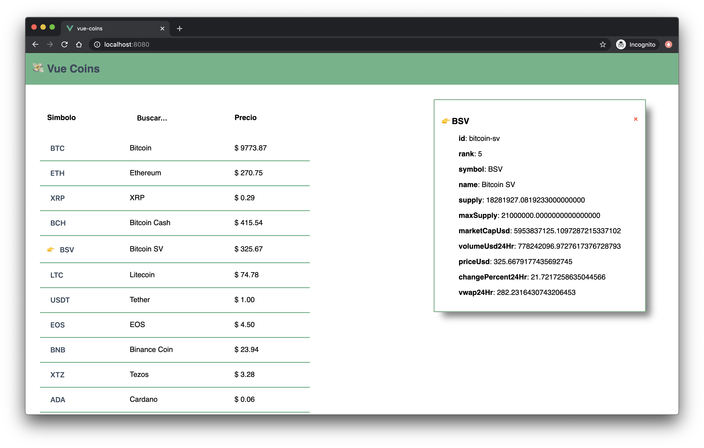

# 💸 vue-coins

Ya generamos el *scaffolding* de nuestra aplicación y por otro lado repasamos cuales son los archivos más importantes de la estructura generada por el CLI.

Ahora que entendemos como funciona todo, es momento de empezar a escribir código de verdad. Para este workshop vamos a crear una aplicación web (*full client-side*) que nos permite interactuar con la [API de Coincap](https://docs.coincap.io).

> 🤑 Coincap es una API pública que nos permite obtener información en tiempo real sobre Criptomonedas.



> En la imagen podes ver una previsualización de la app que vamos a construir.


## Coincap API

Lo primero que vamos a hacer es crear un módulo para interactuar con la api de Coincap.
La ventaja de Vue, como hablamos al principio, es que se encarga solamente de la capa visual de *MV*\*. Entonces tenemos la libertad de manejar la lógica como más nos guste. En este caso para resolver las llamadas HTTP a la API vamos a utilzar la API [fetch](https://developer.mozilla.org/es/docs/Web/API/Fetch_API/Utilizando_Fetch) nativa de los browsers (basada en [Promises](https://developer.mozilla.org/es/docs/Web/JavaScript/Referencia/Objetos_globales/Promise)).

1. Creamos dentro de `src/` una carpeta que se llame `services` y dentro de esta creamos un archivo que con el nombre `coincap.js` ➡️ `src/services/coincap.js`

2. Recuerden que trabajamos con el concepto de módulos: un archivo `.js` es un módulo que podemos importar dentro de otro. Vamos a crear una constante `BASE_URL`.

```javascript
const BASE_URL = 'https://api.coincap.io/v2'
```

1. Tambien vamos a crear y exportar una funciona para luego utilizar en nuestros componentes. Una de las funciones de la API es obtener un [listado completo de *assets* o *coins*](https://docs.coincap.io/?version=latest#89deffa0-ab03-4e0a-8d92-637a857d2c91). Vamos a crear en nuestro servicio un método que interactue con este *endpoint*.

```js
const BASE_URL = 'https://api.coincap.io/v2'

export function getAssets () {
  // Usando template strings de ES2015 armamos la url del endpoint con
  // el formato esperado por la API.
  const url = `${BASE_URL}/assets`

  // Retornamos la llamada de fetch (recuerden que devuelve una Promise).
  // Fetch recibe como primer parametro la url y luego un objeto
  // con configuracion donde pasamos el tipo de metodo HTTP
  return fetch(url, { method: 'GET' })
    .then(res => {
      // En el caso de que hay un error disparamos una excepción
      // para luego manejarla en nuestro componente
      if (res.status !== 200) {
        throw res.statusText
      }

      // Casteamos la respuesta y la devolvemos para
      // usarla luego en el componente
      return res.json()
    })
}

```

Ya tenemos lo que necesitamos para integrar Coincap en los componentes Vue. Como decíamos antes, este código que escribimos es JS plano, podríamos utilizarlo en un proyecto React y funcionaría de la misma manera.

> Esta manera de agrupar funcionalidad en una carpeta `services` es un patrón bastante común y práctico a la hora de desarrollar aplicaciones con Vue. Es importante aclarar que no es obligatorio utilizarlo y podríamos hacerlo de diferentes formas.

___

### 📝 [Solución](https://github.com/ianaya89/vue-coins/tree/08)

[⏪](https://github.com/ianaya89/workshop-vuejs/blob/master/ex/07.md)  [⏩](https://github.com/ianaya89/workshop-vuejs/blob/master/ex/09.md)
