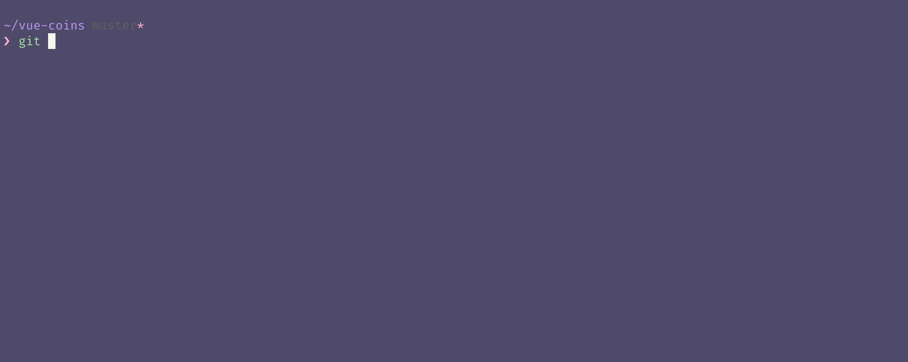

# 🔌 vue-cli plugins

Como explicamos antes, el CLI de Vue esta basado en una arquitectura de *plugins*.
Si inspeccionas el archivo `package.json` vas a encontrar varias dependencias que comienzan con el prefijo `@vue/cli-plugin-...`.

Los plugins pueden hacer varias cosas... simples y complejas: modificar configuraciones internas de webpack, inyectar nuevos comandos de CLI y tambien agregar dependencias o eliminar/modificar archivos de código.

Muchas de las herramientas del ecosistema de Vue (vuex, vue-router, vuetify, cypress, etc) pueden ser incorporadas a tu proyecto utilizando plugins y la forma de hacerlo es muy sencilla.

Abris la terminal, te posicionas en el directorio principal de tu proyecto y corres el comando `vue add [nombre-de-plugin]`. De esta forma podes incoporar soporte para SPA, manejo de estado, librerias de testing y muchas cosas mas, abstranyendote de la configuracio4n inicial y enfocandote en escribir código lo mas rápido posible.

En nuestro caso vamos a utilizar [un plugin custom](https://github.com/ianaya89/vue-cli-plugin-workshop) que cree para este workshop. La idea de este plugin es eliminar ciertos archivos que no necesitamos en el proyecto y agregar algunos archivos con un poco de CSS para facilitar el desarrollo de los ejercicios.

Para agregar el plugin a nuestro proyecto corremos en la terminal el siguiente comando: `$ vue add @ianaya89/workshop` y luego confirmamos la operación.

Cuando el CLI nos crea el proyecto, tambien crea un repositorio de git. Una vez que haya terminado de ejecutarse, podemos usar el comando `git status` para verificar cuales son los archivos que fueron agregados.

> 👌 Es recomendable que antes de instalar cualquier plugin en tu proyecto, no tengas archivos sin *commitear*. De esta forma, es mas fácil revertir los cambios ante cualquier eventualidad.

Los cambios principales que realiza el plugin son:

- Remueve el archivo `src/assets/logo.png` y el componente `HelloWorld.vue`.
- Crea los componentes `CoinList.vue` y `CoinDetail.vue`, con el setup basico de un archivo `.vue` y con un poco de CSS para que podamos enfocarnos directamente en el código.
- Implementa el componente `CoinList.vue` dentro del componente principal (`App.vue`), de la misma forma se hacia con el componente `HelloWorld.vue`.

Si inspeccionas un poco los componentes `CoinList` y `CoinDetail`, vas a ver que ambos tienen bastante código CSS dentro de la etiqueta `<style scoped>`. Al contar con el flag `scoped`, estamos garantizando que las reglas y estilos que escribimos, solo van a "alcanzar" al componente en cuestion y no van afectar los estilos de los componentes externos.

---

### 📝 [Solución](https://github.com/ianaya89/vue-coins/tree/09)

[⏪](https://github.com/ianaya89/workshop-vuejs/blob/master/ex/08.md)  [⏩](https://github.com/ianaya89/workshop-vuejs/blob/master/ex/10.md)
