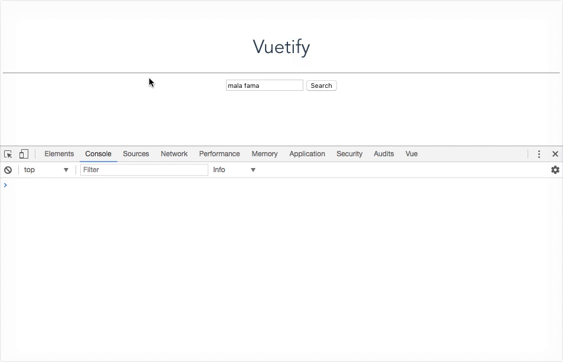
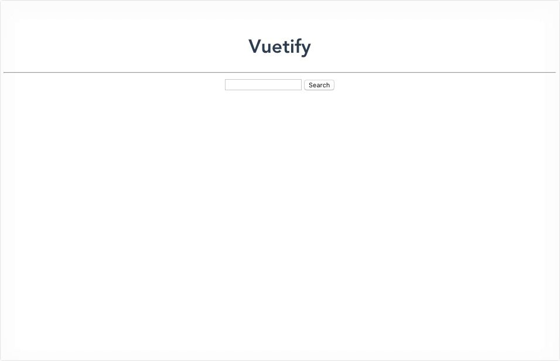

# Servicios + Componentes

Tenemos nuestro componente listo y también nuestra lógica para obtener data de la API. Es momento de combinar ambas cosas.

## `Search.vue`

1. Volvemos a nuestro componente `Search`. Como se imaginan, para poder usar el servicio `spotify` debemos primero importar el modulo.

2. Una vez hecho eso, podemos reemplazar el contenido del método `search` para que interactúe con el método del servicio de `spotify` (también llamado `search`). Recordemos que este ultimo método (que usa Fetch) retorna una *Promise*, por lo cual podemos manejar la respuesta de la API usando la función `.then()`

```html
<script>
  import spotify from '../services/spotify'

  export default {
    name: 'Search',

    data () {
      return {
        query: '',
        results: []
      }
    },

    methods: {
      search () {
        // Hardcodeamos el parametro type con el valor "artist"
        spotify.search(this.query, 'artist')
          .then(res => console.log(res))
      }
    }
  }
</script>
```

> El segundo parametro `spotify.search()` es el tipo de contenido que queremos buscar, por el momento vamos a *hardcodear* el valor "artist".

Podemos testear si funciona de la misma manera que antes, la diferencia es que ahora deberíamos ver en consola la respuesta de la API.



3. Ahora que tenemos la respuesta de la API podemos ver que recibimos un objeto con una propiedad `artists` que a su vez tiene una propiedad `items` de tipo `Array`. Vamos a modificar el callback de la función `.then()` para que podamos asignar el valor de `items` a nuestra propiedad `results` del `vm`.

4. Para mostrar los resultados de la búsqueda en nuestro HTML, nos queda usar un `v-for` que pueda iterar cada elemento de `results` y definir un template apropiado para visualizar la data.

> Pueden definir el markup como mas les guste en base a las propiedades del artista que quieran mostrar. Pueden compararlo luego con la solución.

5. Por ultimo vamos a agregar un poco de CSS, también son libres de elegir los estilos que les gusten en base al HTML que escribieron. Lo unica regla en este punto es agregar el siguiente tag `style` con el atributo `scoped`.

```html
<style scoped>
  /* Aca los estilos */
</style>
```

El atributo `scoped` nos permite restringir el alcance de las reglas CSS que definamos en nuestros selectores. Al usar este atributo todos nuestros estilos definidos en el componente, solamente afectaran a los elementos HTML definidos dentro de ese componente.




___
### 🤓 Extras

1. Podemos agregar un mensaje que diga "No results" cuando `results.length === 0`. Para este caso podemos usar `v-show`.

### 📝 [Solución](https://github.com/ianaya89/workshop-vuejs/blob/master/hints/10.md)
