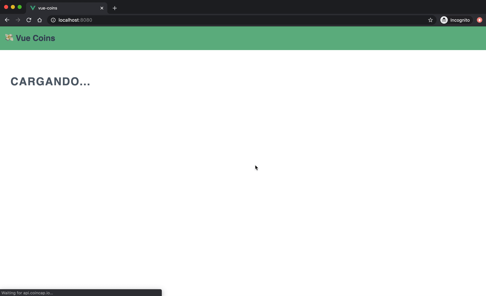

# ♻️ Ciclo de Vida

Cada componente de Vue tiene su propio [ciclo de vida](https://vuejs.org/images/lifecycle.png). Esto quiere decir que desde el momento que se crea hasta que muere, cada instancia atraviesa ciertas etapas o momentos.

Gracias a los *hooks* de Vue, podemos establecer código que se ejecute a medida que nuestro componente vaya pasando por estas etapas. Los *hooks* son funciones (con nombres predeterminados) que se *setean* en el `vm`.

Estos son los *hooks* más importantes en orden de ejecución (se ejecutan una sola vez):

1. `beforeCreate` ➡️ Se crea la instancia pero todavía no se inicializó (no existe `data`, `methods`, etc.)
2. `created` ➡️ Instancia creada e inicializada (podemos acceder a `data`, `methods`, etc.)
3. `beforeMount` ➡️ El template esta compilado pero no está montado en el DOM
4. `mounted` ➡️ El template está compilado y montado en el DOM
5. `beforeDestroyed` ➡️ La instancia está por ser destruida pero todavía es funcional
6. `destroyed` ➡️ La instancia fue destruida (no podemos acceder a `data`, `methods`, etc.)

Y también tenemos estos que pueden ejecutarse N cantidad de veces:

1. `beforeUpdate` ➡️ Se actualizó información pero todavía no se aplicaron los cambios al DOM
2. `updated` ➡️ Se actualizó información y los cambios se aplicaron al DOM


## `created()`

Este es uno de los *hooks* más comunes y utilizados. Sirve principalmente para poder realizar peticiones HTTP, *setear* data o determinar valores defaults (entre otras cosas).

Nosotros lo vamos a utilizar, para que al momento de crearse el componente `CoinList` podamos llamar al servicio de Coincap para obtener la lista de assets.

Para eso vamos a realizar lo siguiente:

1. El primer paso es importar el servicio de coincap dentro del componente. Al igual que hacemos con los componentes de vue, tambien utilizamos *ES Modules* para importar archivos `.js`. Dentro de la parte `<script>` del archivo `src/components/CoinList.vue` importamos el modulo.

```html
<!-- src/components/CoinList.vue -->
<script>
import { getAssets } from '@/services/coincap'

export default {
  name: 'CoinList'
}
</script>
```

> El `@` que precede a `/services` es un alias que nos permtie referenciar el directorio principal de codigo, es decir `.src/`. Es una gran ventaja de @vue/cli (y webpack), ya que no tenemos que lidiar con rutas relativas, sabemos que `@/...` siempre refiere ese directorio y no va a cambiar. Si bien no es obligatorio, recomiendo utilizarlo siempre que podamos.

2. Vamos tambien a agregar la funcion `data` con dos propidades: `assets` (array) y `isLoading` (boolean):

```html
<!-- src/components/CoinList.vue -->
<script>
import { getAssets } from '@/services/coincap'

export default {
  name: 'CoinList',

  data () {
    return {
      assets: [],
      isLoading: true
    }
  }
}
</script>
```

3. Ahora vamos a crear el *hook* `created()` en el componente y haremos una llamada a `getAssets()` dentro del mismo.

```html
<!-- src/components/CoinList.vue -->
<script>
import { getAssets } from '@/services/coincap'

export default {
  name: 'CoinList',

  data () {
    return {
      assets: [],
      isLoading: true
    }
  },

  created () {
    getAssets()
      .then(({ data }) => {
        this.assets = data
        this.isLoading = false
      })
  }
}
</script>
```

Si inspeccionamos la documentación de Coincap o usamos el utilodad *Network* de las herramientas de desarrollo, podemos ver que la lista de assets viene dentro de un objeto llamado `data`. Es por eso que cuando se resuelve la *promise* `getAssets()` asignamos el valor de data a la lista de assets (usando destructuring). Tambien cambiamos el valor de la propiedad `isLoading` a `false`.


4. Para terminar un poco el ejercicio y mostrar la informacion obtenida en la vista, vamos a agregar un poco de HTML y un poco de magia de Vue. Primero agregamos un elemento para indicar que el contenido esta cargando. Este elemento tiene un directiva `v-if`, por lo tanto se va mostrar si y solo si, `isLoading` es `true`.

```html
<!-- src/components/CoinList.vue -->
<template>
  <section tabindex="0">
    <p v-if="isLoading">Cargando...</p>
  </section>
</template>
```

5. Ahora vamos a crear una tabla que combinamos con una directiva `v-for` para representar cada uno de los assets obtenidos por la API. Al contrario del "Cargando...", la tabla solo se muestra cuando `isLoading` es `false`.

```html
<!-- src/components/CoinList.vue -->
<template>
  <section tabindex="0">
    <p v-if="isLoading">Cargando...</p>
    <table v-else>
      <thead>
        <tr>
          <th>Simbolo</th>
          <th>Nombre</th>
          <th>Precio</th>
        </tr>
      </thead>
      <tbody>
        <tr v-for="a in assets" :key="a.id">
          <td>{{ a.symbol }}</td>
          <td>{{ a.name }}</td>
          <td>$ {{ parseFloat(a.priceUsd).toFixed(2) }}</td>
        </tr>
      </tbody>
    </table>
  </section>
</template>
```

En la tabla vamos a mostrar solo 3 propiedades de cada asset: `symbol`, `name` y `priceUsd`. Por otro lado usamos el `id` como identificador univoco para `key` y ademas agregamos un poco JavaScript para formatear el valor de `priceUsd` y evitar un número muy largo `parseFloat(a.priceUsd).toFixed(2)`.



> Todos los *hooks* se implementan de la misma manera, se agrega una función con el nombre del *hook* dentro del `vm` y se ejecuta el código que se requiera. Simplemente tengan en cuenta las limitaciones y características de cada uno.

___

### 📝 [Solución](https://github.com/ianaya89/workshop-vuejs/blob/master/hints/11.md)

[⏪](https://github.com/ianaya89/workshop-vuejs/blob/master/ex/9.md)  [⏩](https://github.com/ianaya89/workshop-vuejs/blob/master/ex/11.md)
