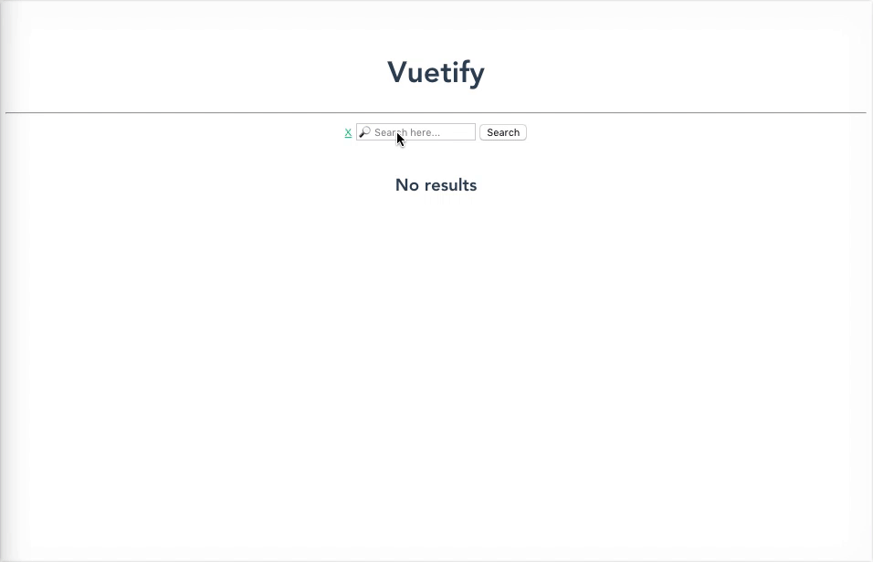

# *Modifiers*

En determinados eventos podemos necesitar cierto comportamiento exclusivo de los eventos como llamar a la función `preventDefault` o chequear el el `keycode` de la tecla que se apretó. Vue nos ofrece una alternativa interesante para lidiar con estos casos de forma mas sencilla y vamos a repasar algunos de ellos.

## `.prevent`

Agregamos al componente `Search`, funcionalidad para reiniciar la búsqueda:

1. Creamos en nuestro objeto `methods` una nueva función llamada `reset`. Dentro de esta vamos a restablecer los valores defaults de `results` y `query`.

2. Luego agregamos un elemento `<a>` en nuestro HTML al cual vamos *linkear* con el metodo `reset` al momento de hacer click. Para este caso vamos a usar de nuevo la directiva `v-on` (o `:@`) pero le vamos a agregar el *modifier* `.prevent`, el cual equivale al tradicional `e.preventDefault()`. De esta manera evitamos que se dispare la acción nativo del tag `<a>` para el evento click.

```html
  <a href="#" @click.prevent="reset">x</a>
```

## `.enter`

Ahora, Ppara mejorar la UX de nuestra aplicación, vamos a permitir que la búsqueda se pueda disparar cuando el usuario presione la tecla *enter* y tenga el foco puesto en el `<input>` de búsqueda. Recuerden que usando `v-on` podemos escuchar cualquier tipo de evento que el elemento HTML disponga.

1. En este caso vamos a usar `v-on` con el evento `keyup` (en el elemento `input`). Para este evento Vue nos ofrece *modifiers* que nos permiten restringirlo a una tecla especifica sin que nosotros tengamos que estar chequeando el `keycode` por código. Usando la misma notación que en el punto anterior *linkeamos* el evento con el modifier `.enter` (al método `search`).



___
### 🤓 Extras

Podemos agregar un componente de tipo *loader* para mostrar un mensaje o un *spiner* mientras la petición HTTP de búsqueda esta en curso. Para eso vamos a necesitar una propiedad `isLoading` en el `vm` que nos permita reconocer cuando la petición esta en curso y cuando no. Tambien vamos a necesitar una directiva `v-show` para la parte de HTML asociada a `isLoading`. En resumen vamos a *setear* el valor de `isLoading` como `true` al comienzo del metodo `search` y como `false` dentro de la funcion `.then()`

### 📝 [Solución](https://github.com/ianaya89/workshop-vuejs/blob/master/hints/11.md)
