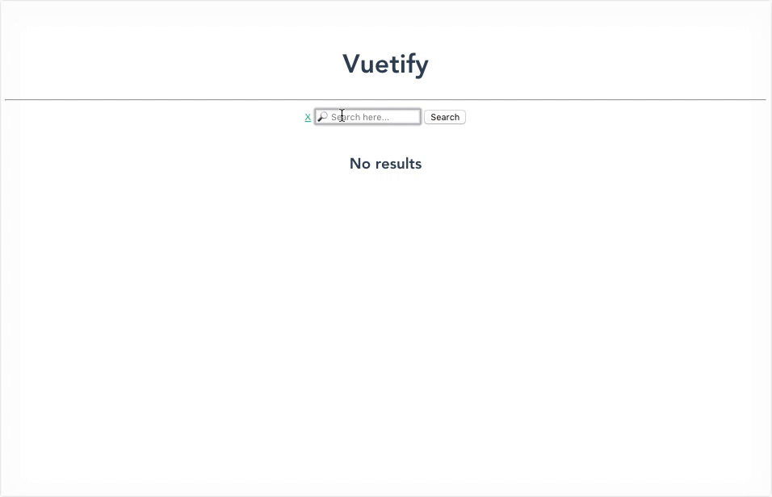
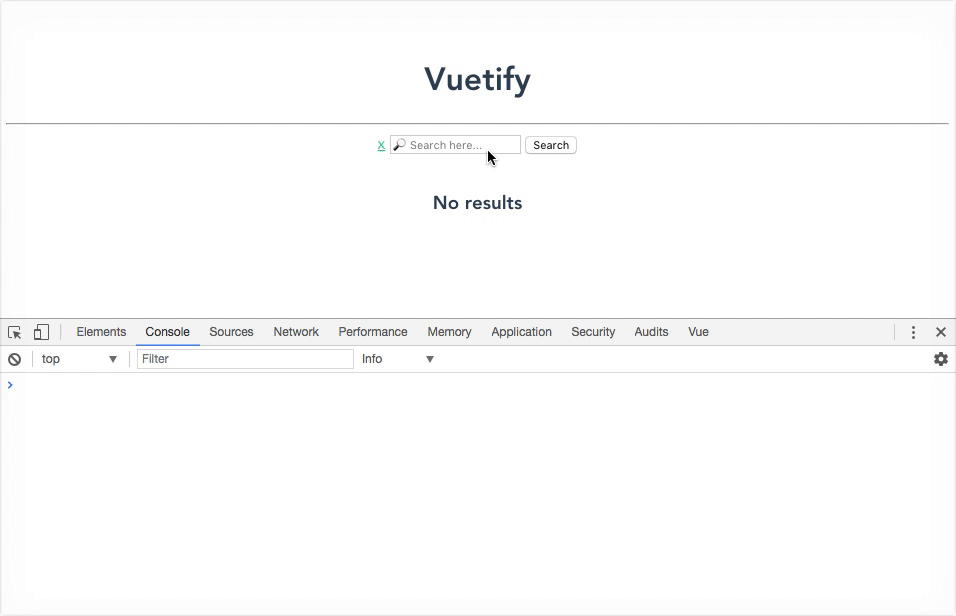

# 👀 *Computed & Watch*

En algunos casos necesitamos mostrar tanta información que el template (HTML) puede ponerse un poco engorroso. En otros casos la información no es abundante pero si el proceso para *parsearla* o formatearla. Para este tipo de problemas Vue nos ofrece dos soluciones diferentes pero parecidas: *Computed Properties* & *Watchers*.

## Computed

Las propiedades computadas son aquellas que se crean a partir de los cambios que puedan efectuarse en una o más propiedades del `vm`. Esto quiere decir que podemos tener una propiedad dinámica cuyo valor va a calcularse cada vez que otra/s propiedad/es cambien sus valores.

1. Siempre dentro del componente `Search`, creamos un nuevo objeto con el nombre `computed` en el `vm`.
2. Dentro de este objeto definimos una función con el nombre 'found'. Es importante saber que las propiedades computadas son funciones que devuelven un resultado (siempre tienen un `return`)
3. En el cuerpo de esta función vamos a retornar un mensaje (`String`) en base a la cantidad de elementos dentro de `results`.
  * Si `this.results.length > 0` devuelvo un `String` como `'X items found'`.
  * Sino devuelvo un `String` vacío.
4. En el lado HTML las propiedades computadas se utilizan de la misma manera que las propiedades convencionales. Agregamos un tag `<small>` y mostramos dentro del mismo, el valor de la propiedad `found` usando una expresion: `{{ found }}`.

> Aclaramos que la API usa paginación y en nuestro ejemplo no estamos implementándola, por lo cual la cantidad máxima de elementos siempre será 20.

De ahora en más, cada vez que la propiedad `results` se modifique, el valor de nuestra computed `found` va a recalcularse.

## Watchers

Los watchers tienen un comportamiento muy similar. Son funciones que se van a ejecutar cada vez que una propiedad modifique su valor. La diferencia es que estas funciones no retornan un valor sino que son simplemente son observables que van a disparar ejecuciones de código. Un buen caso de uso seria ejecutar una petición HTTP cada vez que el valor de una propiedad se modifique.

Para este ejemplo vamos a crear un watcher sobre la propiedad `query` que simplemente imprima en consola cada vez que esta propiedad cambia:

1. Creamos un objeto con el nombre `watch` dentro del `vm`.
2. Dentro del objeto creamos una función con el nombre `query`. En el caso de los watchers se observan propiedades específicas, por lo cual el nombre de la función watcher debe ser igual al nombre de la propiedad que queremos observar.
3. Esta nueva función puede recibir dos argumentos: el primero es el nuevo valor de la propiedad en cuestión, el segundo es el valor anterior de esta propiedad. En el cuerpo de la función podemos poner un `console.log` que imprima ambos valores para comprobar el funcionamiento.

> Este watcher nos es más que un ejemplo para comprender como funciona. Una vez que termine el ejercicio podemos comentar el código ya que los mensajes en consola pueden resultar bastante molestos 🙃

___
### 📝 [Solución](https://github.com/ianaya89/workshop-vuejs/blob/master/hints/12.md)
