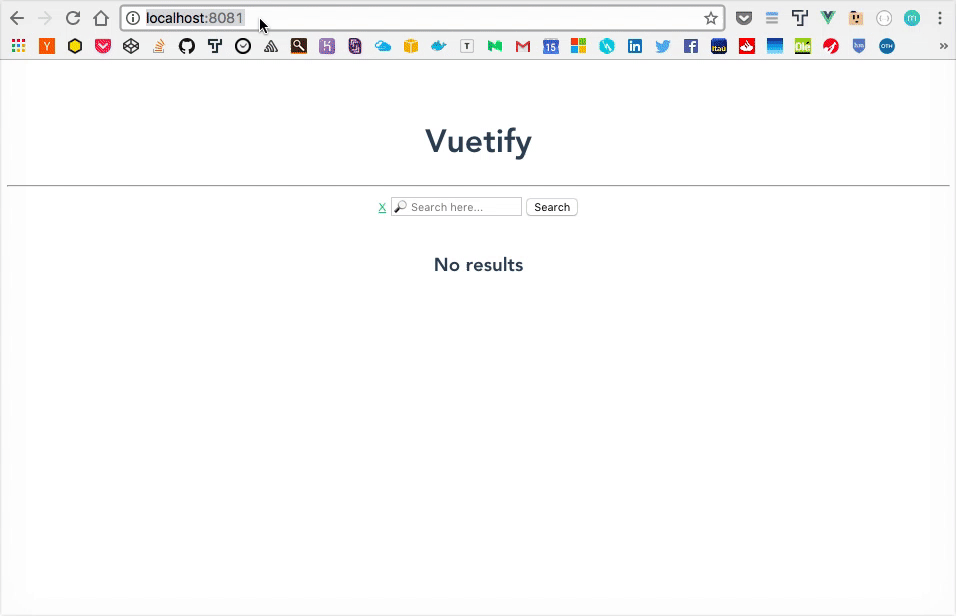

# ♻️ Clico de Vida

Cada componente de Vue tiene su propio (ciclo de vida)[https://vuejs.org/images/lifecycle.png]. Esto quiere decir que desde el momento que se crea hasta que muere, cada instancia atraviesa ciertos etapas o momentos.

Gracias a los *hooks* de Vue, podemos establecer codigo que se ejecute a medida que nuestro componente vaya invocando estas etapas. Los *hooks* son funciones (con nombres predeterminados) que se *setean* en el `vm`.

Estos son los mas importantes *hooks* en orden de ejecución (se ejecutan una sola vez):

1. `beforeCreate` ➡️ Se crea la instancia pero todavia no se inicilizo (todavia no existe `data`, `methods`, etc.)
2. `created` ➡️ Instancia creada e inicilizada (podemos acceder a `data`, `methods`, etc.)
3. `beforeMount` ➡️ template compilado pero no esta montado en el DOM
4. `mounted` ➡️ template compilado y montado en el DOM
5. `beforeDestroyed` ➡️ La instancia esta por ser destruida pero todavia es funcional
6. `destroyed` ➡️ La instancia fue destruida (no podemos acceder a `data`, `methods`, etc.)

Y tambien tenemos estos que pueden ejecutarse N cantidad de veces:

1. `beforeUpdate` ➡️ Se actualizo informacion pero todavia no se aplicaron los cambios al DOM
2. `updated` ➡️ Se actualizo informacion y los cambios se aplicaron al DOM


## `created`

Agregamos a nuestra app un caso de uso para poder usar el *hook* `created.`. Este es uno de los mas comunes y utilizados. Sirve principalmente para poder obtener informacion de peticiones a HTTP, inicilizar data o determinar valores defaults (entre otras cosas).

Para este ejercicio vamos a soportar que alguien pueda acceder a nuestra aplicación pasando el valor de la busqueda como la primer parte del path de la URL y disparar la busqueda de forma automatica tomando ese valor. Por ejemplo si alguien ingresa directamente al sitio con esta URL `http://localhost:8081/rafaga` deberiamos ejecutar el metodo `search` con la query `rafaga`.

1. Primero vamos a crear el *hook* `created`. Como explicamos antes, la forma de crearlo es agrando una funcion con el nombre `created` dentro de nuestro `vm`.
2. Dentro de esta funcion vamos a tomar el path de la URL usando el objeto location del browser: `location.pathname`.
3. Ahora debemos identificar cuando estan pasand un valor de busqueda y cuando no. Esto podemos determinarlo a traves de la cantidad de caracteres de `location.pathname`.
  1. Si `location.pathname === '/'` signfica que no se esta especificando ningun valor de busqueda, por lo cual no deberiamos hacer nada.
  2. Si `location.pathname !== '/'` quiere decir que tenemos un valor default para nuestra propiedad `query`. En ese caso dentro del *hook* vamos a asignar el valor del `pathname` a `query` (tenga en cuenta que deberiamos evadir el primer caracter de `pathname` ya que es `'/'`) y luego vamos a llamar al metodo `search`.

  


  ```javascript
  created () {
    if (location.pathname === '/') { return }

    // El primer caracter es '/' por lo cual vamos a omitirlo
    this.query = location.pathname.substring(1)
    this.search()
  },
  ```

> Todos los hooks se implementan de la misma manera, se agrega una funcion con el nombre del *hook* dentro del `vm` y se ejecuta el codigo que se requiera. Simplemente tengan en cuenta las limitaciones y caracteristicas de cada uno.

___
### 📝 [Resolución](https://github.com/ianaya89/vuetify/blob/ex-13/src/services/spotify.js)
