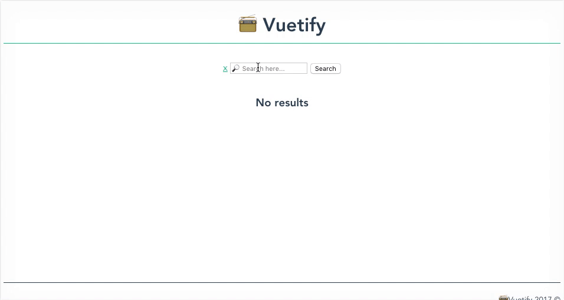

# 🍞 Toaster

Para el ultimo ejercicio del workshop vamos a crear un nuevo componente de tipo *toaster*. Hasta ahora vimos como podemos hacer para que un componente padre le mande información o data a un componente hijo (usando `props` y definiendo atributos HTML custom). Ahora usando este nuevo componente vamos a ver como seria la comunicación desde el hijo hacia el padre.

## `Toaster.vue`

1. Lo primero que vamos a hacer es crear un nuevo componente llamado `Toaster.vue` ➡️ `src/components/Toaster.vue`. La idea de este nuevo componente es darle *feedback* al usuario cuando se desencadenan operaciones asincrónicas (como peticiones HTTP).

2. En la parte de template escribimos el siguiente HTML:
```html
<template lang="html">
  <div :class="`toaster ${type}`">
    <span class="close" @click="close">x</span>
    <p> {{ message }}</p>
  </div>
</template>
```

En el HTML tenemos tres cosas para destacar:
* Usamos `:class="`toaster ${type}`"` para la clase del elemento sea dinámica. Estamos diciendo que las clases para ese tag son: `"toaster"` y el valor asignado a una propiedad llamada `type`. Para esto utilizamos [*template literals*](https://developer.mozilla.org/en/docs/Web/JavaScript/Reference/Template_literals) para pasar como resultado final un string concatenando ambas clases.
* Definimos un `<span>` que nos va a servir como botón para que el usuario pueda cerrar el *toaster*. A este elemento le agregamos un *listener* al evento `click` usando `@click="close"`. Cada vez que haya un click sobre el elemento ejecutamos el método `close`
* Dentro de un tag `<p>` usamos una expression para mostrar el valor de la propiedad message ➡️ `{{ message }}`


3. Dentro del componente vamos a ingresar los siguientes estilos. Si quieren pueden personalizarlo o cambiar lo que consideren:

```html
<style scoped>
  .toaster {
    position: fixed;
    left: 20px;
    bottom: 20px;
    width: 400px;
    padding: 5px;
    color: #fff;
  }

  .error {
    background-color: tomato;
  }

  .success {
    background-color: lime;
  }

  .close {
    margin-left: 15px;
    color: #fff;
    font-weight: bold;
    float: right;
    font-size: 22px;
    line-height: 20px;
    cursor: pointer;
  }
</style>
```

Hasta ahora esto que vimos no tiene ningún secreto, es mas o menos lo mismo que veníamos haciendo para los otros componentes. Vamos entonces a ver que pasa con el `vm` de `Toaster.vue`

4. En la parte de `<script>` vamos a definir el siguiente código para el `vm`:

```html
<script>
  export default {
    name: 'Toaster',

    props: {
      message: { type: String },
      type: {
        type: String,
        // Establece una valor default para la propiedad en caso que el componente padre no lo asigne.
        default: 'error'
      }
    },

    methods: {
      close () {
        // Emitimos un evento para comunicarle al componente padre que algo ocurrió
        this.$emit('close', {})
      }
    }
  }
</script>
```

Como pueden ver, un concepto nuevo entra en escena y es el método interno `$emit()`. Vue tiene varios métodos internos que podemos acceder usando `this`. Todos ellos comienzan con el prefijo `$` (no debemos usarlo para métodos custom).

El método `$emit()` nos permite emitir eventos personalizados para que luego el componente padre pueda escucharlos y ejecutar el comportamiento necesario. El método recibe dos argumentos: nombre del evento e información que se quiere pasar al componente padre.

5. Ahora tenemos que insertar el componente `Toaster.vue` dentro de `Search.vue` usando `import` y registrando el *toaster* dentro del objeto `components` del *search*.

6. Vamos a necesitar también agregar dos variables nuevas a `Search.vue`: `showToaster` (inicializada en `false`) y `toasterMessage` (inicializada en `String` vacío).

7. Seguimos dentro de `Search.vue`, tenemos que agregar un nuevo método llamado `toggleToaster` que invierta el valor de la propiedad `showToaster`. Si esta es `true` debe asignarle `false` y viceversa.

8. Tenemos que hacer que el *toaster* se muestre en caso de que haya un error interactuando con la API de Spotify. Entonces vamos a cambiar un poco el método `search` para que pueda manejar estas excepciones usando el método `catch()` de *Promises*.

```javascript
search () {
  spotify.search(this.query, 'artist')
    .then(res => {
      console.log(res)
      this.results = res.artists.items
    })
    .catch(err => {
      this.toggleToaster()
      this.toasterMessage = err
    })
},
```

Con este nuevo código, cada vez que tengamos un error como respuesta de la API vamos *setear* el mensaje de error en `toasterMessage` y llamar a *toggleToaster()* para mostrar el mensaje.

9. Lo último que nos queda es insertar el tag `<toaster>` dentro del HTML de `Search.vue`:

```html
<toaster v-show="showToaster" :message="toasterMessage" @close="toggleToaster"></toaster>
```

* Usamos `v-show` para que `Search.vue` sea quien controle cuando ocultar o mostrar el *toaster*.
* Con `:message="toasterMessage"` relacionamos a la propiedad `message` de `Toaster.vue` con la propiedad `toasterMessage` de `Search.vue`
* Lo mas importante es que usando `@close="toggleToaster"`, le estamos diciendo a `Search.vue` que responda con el método `toggleToaster` cada vez que `Toaster.vue` dispare un evento llamado `close`. Recuerden que `close` es el nombre del evento que definimos dentro del *toaster* con `this.$emit`.

Para probar el correcto funcionamiento de lo que hicimos podemos hacer click en el botón search sin introducir ningún valor en el '<input>' de búsqueda, esto debería devolver un error `400` por parte de la API ya que el parámetro `query` esta vacío. Una vez abierto el *toaster* debería cerrarse cuando hagamos click en `X`

> En HTTP se utiliza el *status code* 400 para indicar que el request no es correcto, generalmente porque lo parámetros o la información que se envía es errónea o insuficiente



En resumen la comunicación Padre ➡️ Hijo es usando propiedades y atributos HTML y la comunicación Hijo ➡️ Padre es emitiendo eventos.

___
### 🤓 Extras
El *toaster* no necesariamente debe usarse para mostrar errores, podemos usarlo también para informarle al usuario que la data se obtuvo de manera correcta. Podemos usar el mismo patron para mostrar el *toaster* dentro del método `then()` de la *Promise* con un mensaje como `"Artists retrieved successfully"`. Deberíamos también crear una nueva propiedad en `Search.vue` que nos permita pasar una valor dinámico a la propiedad `type` de `Toaster.vue` y de esta manera cambiar el color del *toaster* según el tipo de error.

### 📝 [Solución](https://github.com/ianaya89/workshop-vuejs/blob/master/hints/16.md)

[⏪](https://github.com/ianaya89/workshop-vuejs/blob/master/ex/15.md)  [⏩](https://github.com/ianaya89/workshop-vuejs/blob/master/ex/17.md)
