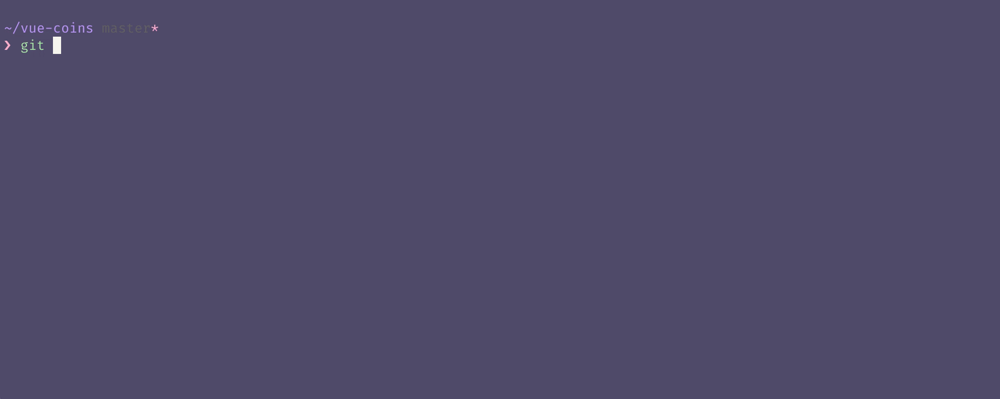

# 🔌 vue-cli plugins

Como explicamos antes, el CLI de Vue esta basado en una arquitectura de *plugins*.
Si inspeccionas el archivo `package.json` vas a encontrar varias dependencias que comienzan con el prefijo `@vue/cli-plugin-...`.

Los plugins pueden hacer varias cosas simples y complejas: modificar configuraciones internas de webpack, inyectar nuevos comandos de CLI y tambien cosas simples como agregar dependencias o eliminar/modificar archivos de codigo.

Muchas de las herramientas del ecosistema de Vue (vuex, vue-router, vuetify, cypress, etc) pueden ser incorporadas a tu proyecto utilizando plugins y la forma de hacerlo es muy sensilla.

Abris la terminal, te posicionas en el directorio principal de tu proyecto y corres el comando `vue add [nombre-de-plugin]`. De esta forma podes incoporar soporte para SPA, manejo de estado, librerias de testing y muchas cosas mas, abstranyendote de la configuracion inicial y enfocandote en escribir codigo lo mas rapido posible

En nuestro caso vamos a utilizar [un plugin custom muy basico](https://github.com/ianaya89/vue-cli-plugin-workshop). La idea de este plugin es eliminar ciertos archivos que no necesitamos en el proyecto y agregar algunos archivos con un poco de CSS para facilitar el desarrollo de los ejercicios.

Para agregar el plugin a nuestro proyecto corremos en la terminal el siguiente comando: `$ vue add @ianaya89/workshop` y luego confirmamos la operación.

Cuando el CLI nos crea el proyecto, tambien crea un repositorio de git. Una vez que haya terminado de ejecturse, podemos usar el comando `git status` para verificar cuales son los archivos que fueron agregados.

> Es recomendable que antes de instalar cualquier plugin en tu proyecto, no tengas cambios sin commitear. De esta forma, es mas facil revertir los cambios ante cualquier eventualidad.

[⏪](https://github.com/ianaya89/workshop-vuejs/blob/master/ex/08.md)  [⏩](https://github.com/ianaya89/workshop-vuejs/blob/master/ex/10.md)
