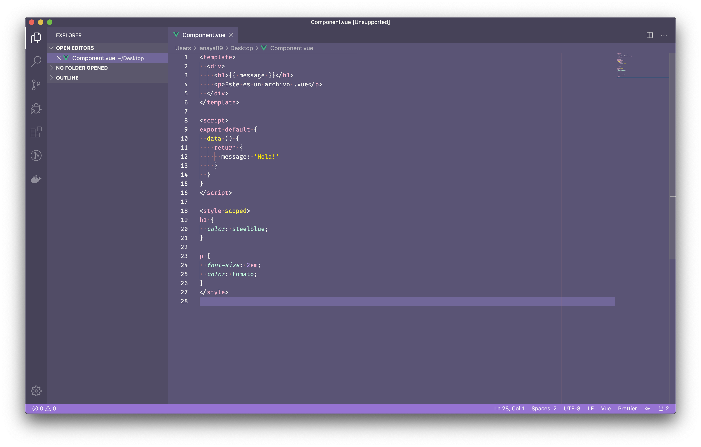

# 📻 Vuetify

Ahora que ya sabemos los conceptos basicos de Vue, vamos a aprender a crear aplicaciones web mas profesionales. Hasta ahora vimos que implementar el framework es muy facil, simplemente tenemos que agregar la libreria y crear nuestra instancia con `new Vue({})`. El asunto es que en la mayoria de los casos vamos a querer hacer aplicaciones mas complejas en lugar de prototipos o cosas basicas.

Recordemos que Vue esta basado en un concepto progresivo y que a medida que nuestra aplicacion incremente la complejidad podemos acompañar ese proceso con herramientas o librerias que nos permitan trabajar de manera mas optima.

### Componentes en Archivos (`.vue`)

Lo primero que vamos aprender ahora es la *magia* de los archivos `.vue`. Esto nos permite crear componentes en archivos (1 componente = 1 archivo) y escribir todo codigo, vista y estilo que pertenece a ese componente.

La estructura de un archivo `.vue` es la siguente:

